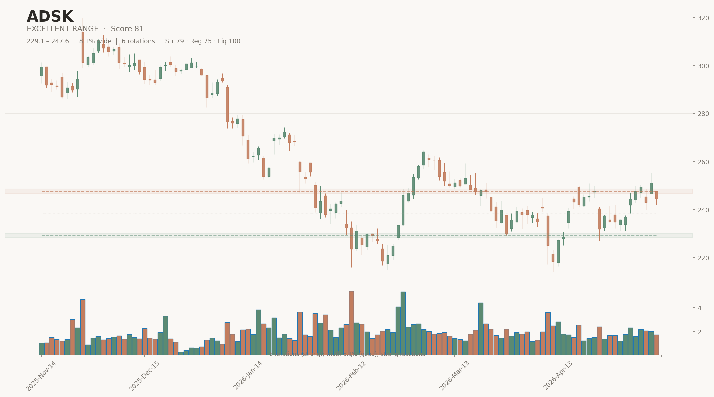
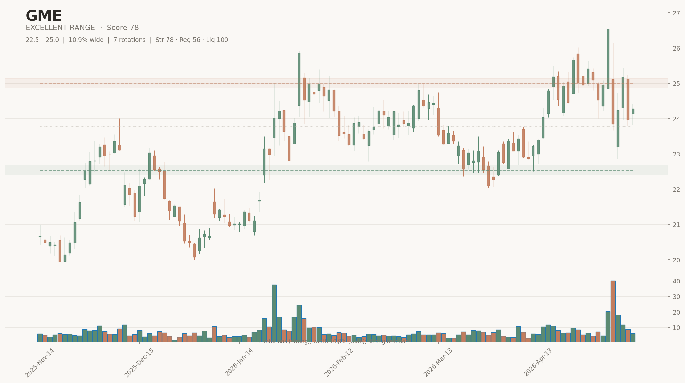
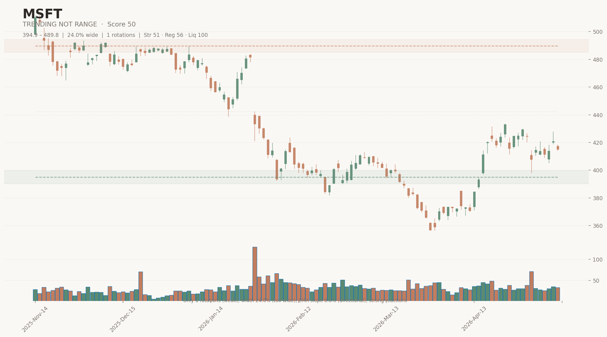

<p align="center">
  
</p>

<h1 align="center">Range Scanner</h1>

<p align="center">
  <strong>Market structure filter that finds stocks trading in clean ranges<br>
  and tells you what to do about it.</strong>
</p>

<p align="center">
  <em>Not a trading bot. Not a prediction engine. A decision-support tool.</em>
</p>

<p align="center">
  <a href="#quick-start">Quick Start</a> ·
  <a href="#dashboard">Dashboard</a> ·
  <a href="#how-it-works">How It Works</a> ·
  <a href="#examples">Examples</a> ·
  <a href="#universes">Universes</a>
</p>

---

## What It Does

Given a list of stock tickers, the scanner answers **four questions** for each one:

| Question | Output | Example |
|----------|--------|---------|
| Is this a clean range? | Range Score (0-100) | ADSK: **81** |
| Is the entry timing good? | Entry Quality (0-100) | TMO near support: **76** |
| Does the market support this? | Context Score (0-100) | Calm market + stable sector: **75** |
| What should I actually do? | Setup Type | `BREAKOUT_WATCH_UPSIDE` |

Then it explains **why** in plain English:

> *"ADSK shows a well-defined range between $229 and $247 (8.1% width). Price has rotated 6 times. Currently pressing resistance — with XLK trending up in a risk-on market, this looks more like a breakout setup than a mean-reversion short."*

---

## Quick Start

```bash
# Install
pip install -e ".[dev]"

# Add your Alpaca API keys
cp .env.example .env
# Edit .env with your keys (free paper account works)

# Run a scan
python -m range_scanner --universe nasdaq100 --output results.csv

# With market context + chart export
python -m range_scanner --universe nasdaq100 --context --charts --top 20

# Launch the dashboard
streamlit run src/range_scanner/dashboard/app.py
```

---

## Dashboard

A full Streamlit web interface with 5 pages:

```
┌─────────────────────────────────────────────────────────────────────┐
│                                                                     │
│  ◐ Range Scanner                                                    │
│  ─────────────────                                                  │
│                                                                     │
│  Scanner        Scan any universe. Interactive results table.       │
│                 Progress bar. Narratives for top picks.             │
│                                                                     │
│  Ticker Detail  Deep-dive any ticker. All scores, risk flags,       │
│                 price chart, position-in-range bar, score breakdown. │
│                                                                     │
│  Charts         Gallery of exported candlestick PNGs.               │
│                 Filter by ticker or verdict.                        │
│                                                                     │
│  Backtest       Did the scanner's ranges actually hold?             │
│                 Structure persistence test with hold-rate metrics.  │
│                                                                     │
│  Settings       API keys, thresholds, reference docs.               │
│                 "What is range trading?" explainer built in.        │
│                                                                     │
└─────────────────────────────────────────────────────────────────────┘
```

Launch with:
```bash
streamlit run src/range_scanner/dashboard/app.py
```

Japandi-styled: warm linen background, sage green accents, Inter + JetBrains Mono typography. Designed following 50 research-backed [design rules](DESIGN_RULES.md).

---

## Examples

### Excellent Range — ADSK


```
ADSK | EXCELLENT_RANGE | Score 81 | Entry 66 | Near Resistance
Range: $229 – $247 | Width: 8.1% | Rotations: 6
Reason: 6 rotations (strong); width 8.1% (good); strong reactions;
        5 false breaks (zones validated); volume concentrated at resistance
```

**Narrative:** *"This is a high-quality range structure. ADSK is trading in a well-sized range between $229 and $247. Price has rotated 6 times. Currently pressing resistance — in a risk-on market with XLK trending up, this looks more like a breakout setup than a mean-reversion short."*

---

### Range Pressing Resistance with Squeeze Risk — GME



```
GME | EXCELLENT_RANGE | Score 78 | Entry 41 | Upper Half
Range: $22.5 – $25.0 | Width: 10.9% | Rotations: 7
Short Interest: 15.1% | Days to Cover: 9.8
Reason: 7 rotations (strong); 27 false breaks (zones validated);
        volume balanced; SI 15% float (HIGH crowding)
```

**Narrative:** *"GME is trading in a somewhat wide range between $22 and $25. 7 rotations over months confirm both zones. 27 false breaks — this range has been heavily tested. However, high short interest (15% of float) creates squeeze risk near resistance."*

---

### Correctly Rejected — MSFT (Trending)



```
MSFT | TRENDING_NOT_RANGE | Score 50 | Entry 0 | Broken Up
Reason: Only 1 rotation (weak); width 24% (too wide);
        EMA slope 8.8% (directional); BROKEN above resistance
```

**Narrative:** *"MSFT is currently trending rather than range-bound. Despite detecting some boundaries, the directional momentum is too strong for reliable range trading."*

---

## How It Works

```
  DATA             STRUCTURE           STATE              CONTEXT           OUTPUT
  ────             ─────────           ─────              ───────           ──────

  Alpaca API       Pivot detection     Position in        Market regime     Verdict
  Daily OHLCV      Zone clustering     range (0-1)        (SPY/QQQ)         Setup type
  Paginated        Rotations           Edge position      Sector trend      Narrative
  Concurrent       Reactions           Breakout risk      Relative str.     Score
  Cached           Tightness           Entry quality      Earnings risk     Chart
                   False breaks                           Short interest
                   Volume profile
                   Containment
                   Trend leakage
                   Gap frequency
                   Compression
```

### Scoring (Range Quality)

| Component | Weight | What it measures |
|-----------|--------|------------------|
| Rotation count | 20% | Full oscillations between zones (THE key metric) |
| Reaction strength | 10% | How strongly price bounces after touching a zone |
| Containment | 10% | % of closes that stayed inside the range |
| Tightness | 8% | Whether price uses the full range, not just middle |
| Range width | 7% | 3-8% is ideal for swing trading |
| Support touches | 5% | Confirmed reactions at support |
| Resistance touches | 5% | Confirmed reactions at resistance |
| ADX | 10% | Trend strength (lower = more sideways = better) |
| EMA slope | 5% | Directional drift (flatter = better) |
| Trend leakage | 10% | Higher-highs/lows pattern (less = better) |
| Liquidity | 5% | Dollar volume above threshold |
| ATR stability | 5% | Daily volatility in usable range (1-6%) |

### Hard Gates

```
Range width > 25%     →  Score capped at 30, verdict TOO_WIDE
Range width > 15%     →  Score capped at 50, verdict WIDE_RANGE
Rotations < 2         →  Score capped at 55
Price above resistance →  BROKEN_UP
Price below support    →  BROKEN_DOWN
ADX > 30              →  TRENDING_NOT_RANGE
```

---

## Risk Layers

| Risk | Source | What it catches |
|------|--------|-----------------|
| **Gap frequency** | OHLCV data | Stocks that teleport past support/resistance overnight |
| **Compression** | ATR(5)/ATR(20) | Volatility coiling before breakout |
| **Earnings** | yfinance | Binary events that destroy range structure |
| **Short interest** | yfinance | Squeeze risk at resistance, crowding |
| **False breaks** | OHLCV data | Fakeouts that validate zones (positive signal) |
| **Volume profile** | OHLCV data | Where trading acceptance lives |

---

## Universes

22 pre-built ticker lists organized by scanning strategy:

| Universe | Tickers | Best for |
|----------|---------|----------|
| `utilities` | ~40 | Classically range-bound, lowest ADX sector |
| `dividend_aristocrats` | ~55 | Yield floor creates repeatable bands |
| `low_volatility` | ~50 | Slow movers, S/R persists months |
| `reits` | ~55 | Rate-driven, tight ranges |
| `nasdaq100` | ~90 | Broad liquid tech/growth |
| `sp500` | ~470 | Comprehensive large-cap scan |
| `consumer_staples` | ~45 | Defensive, steady ranges |
| `semiconductors` | ~50 | Volatile but defined channels |
| `meme_speculative` | ~40 | Post-squeeze resting phases |
| `high_short_interest` | ~45 | Squeeze potential near resistance |
| `sector_etfs` | ~100 | Less event-driven than single stocks |
| `ai_robotics` | ~50 | Post-hype consolidations |
| + 10 more | | cannabis, biotech, clean energy, etc. |

```bash
python -m range_scanner --universe utilities --context --top 20
python -m range_scanner --universe reits --charts --top 15
python -m range_scanner --universe meme_speculative --context --top 10
```

---

## Setup Types

When `--context` is enabled, each ticker gets classified into an actionable setup:

| Setup | Meaning | When it triggers |
|-------|---------|------------------|
| `MEAN_REVERSION_LONG` | Potential buy near support | Near support + good RS + favorable market |
| `MEAN_REVERSION_SHORT` | Potential short near resistance | Near resistance + calm market + low breakout risk |
| `BREAKOUT_WATCH_UPSIDE` | Watch for upside breakout | Near resistance + risk-on + sector trending |
| `BREAKDOWN_WATCH_DOWNSIDE` | Watch for downside break | Near support + high volume + price falling |
| `RANGE_MONITOR_ONLY` | Watchlist, wait for edge | Valid range but price is mid-range |
| `AVOID_CONTEXT_CONFLICT` | Edge exists but context fights it | Near support but badly underperforming |
| `NOT_RANGE_TRADE` | Don't apply range logic | Broken, trending, or invalid |

---

## Validation

### Visual Review
```bash
# Export charts for top candidates
python -m range_scanner --universe nasdaq100 --charts --top 10
# Charts saved to charts/ directory
```

### Structure Backtest
```bash
# Test: did "excellent" ranges actually hold for 10 days?
python validation/backtest.py results/nasdaq100.csv --days 10
```

### Human Labeling
```bash
# After reviewing charts, label in validation/labels.csv
# Then check agreement rate:
python validation/validate.py results/nasdaq100.csv
```

---

## CLI Reference

```bash
python -m range_scanner [OPTIONS]
```

| Option | Default | Description |
|--------|---------|-------------|
| `--tickers` | `tickers.txt` | Path to ticker file |
| `--universe` | — | Built-in universe name |
| `--lookback` | `120` | Trading days of history |
| `--output` | `results.csv` | CSV output path |
| `--min-volume` | `1000000` | Min daily share volume |
| `--min-dollar-volume` | `20000000` | Min daily dollar volume |
| `--top` | `20` | Results to display |
| `--charts` | off | Export PNG charts |
| `--charts-dir` | `charts/` | Chart output directory |
| `--context` | off | Add market/sector context |

---

## Project Structure

```
range-scanner/
  CLAUDE.md                       Project spec
  README.md                       This file
  DESIGN_RULES.md                 50-rule UI design system
  pyproject.toml                  Dependencies
  .env                            API keys (git-ignored)

  src/range_scanner/
    cli.py                        Typer CLI entry point
    config.py                     All thresholds in one place
    data.py                       Alpaca API (concurrent, cached)
    indicators.py                 ATR, ADX, EMA, gaps, compression
    structure.py                  Pivots, zones, rotations, false breaks, volume profile
    scoring.py                    Weighted scoring + verdicts
    state.py                      Edge position, entry quality, breakout risk
    context.py                    Market regime, sector, RS, earnings, short interest
    setup.py                      Setup type classification
    reasoning.py                  AI-style narrative generation
    output.py                     CSV + rich console table
    charts.py                     Japandi candlestick PNGs
    models.py                     Pydantic models
    dashboard/                    Streamlit web UI (5 pages)

  universes/                      22 pre-built ticker lists
  validation/                     Labeling tool + backtest
  tests/                          74 unit tests
  docs/images/                    Screenshots and charts
```

---

## Tests

```bash
pytest tests/ -v
```

74 tests covering indicators, structure detection, scoring, verdicts, and sub-scores.

---

## Philosophy

```
┌───────────────────────────────────────────────────────────────┐
│                                                               │
│   The scanner classifies structure, assesses context,         │
│   and tells you what kind of situation you're looking at.     │
│                                                               │
│   It does NOT predict price.                                  │
│   It does NOT recommend trades.                               │
│   It does NOT manage risk.                                    │
│                                                               │
│   The human decides whether to act.                           │
│                                                               │
└───────────────────────────────────────────────────────────────┘
```
